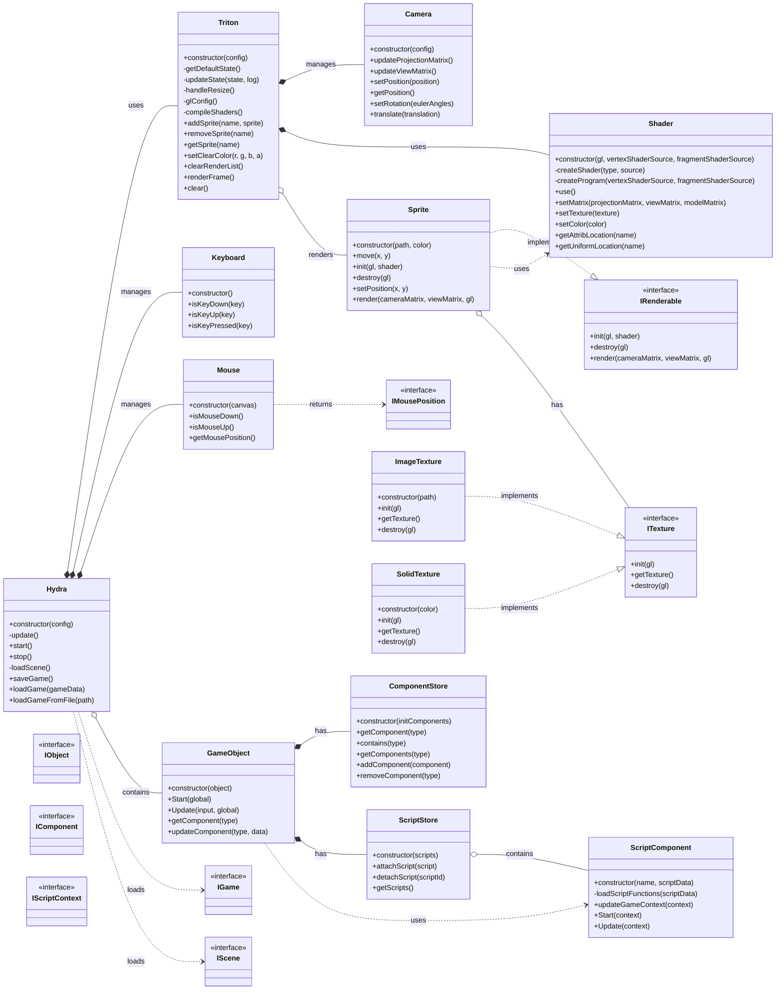

```mermaid
classDiagram
    direction LR

    %% Main Engine Classes
    class Hydra {
        +constructor(config)
        -update()
        +start()
        +stop()
        -loadScene()
        +saveGame()
        +loadGame(gameData)
        +loadGameFromFile(path)
    }

    class Triton {
        +constructor(config)
        -getDefaultState()
        -updateState(state, log)
        -handleResize()
        -glConfig()
        -compileShaders()
        +addSprite(name, sprite)
        +removeSprite(name)
        +getSprite(name)
        +setClearColor(r, g, b, a)
        +clearRenderList()
        +renderFrame()
        +clear()
    }

    %% Input Classes
    class Keyboard {
        +constructor()
        +isKeyDown(key)
        +isKeyUp(key)
        +isKeyPressed(key)
    }

    class Mouse {
        +constructor(canvas)
        +isMouseDown()
        +isMouseUp()
        +getMousePosition()
    }

    %% Game Classes
    class GameObject {
        +constructor(object)
        +Start(global)
        +Update(input, global)
        +getComponent(type)
        +updateComponent(type, data)
    }

    class ComponentStore {
        +constructor(initComponents)
        +getComponent(type)
        +contains(type)
        +getComponents(type)
        +addComponent(component)
        +removeComponent(type)
    }

    class ScriptStore {
        +constructor(scripts)
        +attachScript(script)
        +detachScript(scriptId)
        +getScripts()
    }

    class ScriptComponent {
        +constructor(name, scriptData)
        -loadScriptFunctions(scriptData)
        +updateGameContext(context)
        +Start(context)
        +Update(context)
    }

    %% Rendering Classes
    class Sprite {
        +constructor(path, color)
        +move(x, y)
        +init(gl, shader)
        +destroy(gl)
        +setPosition(x, y)
        +render(cameraMatrix, viewMatrix, gl)
    }

    class Shader {
        +constructor(gl, vertexShaderSource, fragmentShaderSource)
        -createShader(type, source)
        -createProgram(vertexShaderSource, fragmentShaderSource)
        +use()
        +setMatrix(projectionMatrix, viewMatrix, modelMatrix)
        +setTexture(texture)
        +setColor(color)
        +getAttribLocation(name)
        +getUniformLocation(name)
    }

    class Camera {
        +constructor(config)
        +updateProjectionMatrix()
        +updateViewMatrix()
        +setPosition(position)
        +getPosition()
        +setRotation(eulerAngles)
        +translate(translation)
    }

    %% Texture classes
    class ImageTexture {
        +constructor(path)
        +init(gl)
        +getTexture()
        +destroy(gl)
    }

    class SolidTexture {
        +constructor(color)
        +init(gl)
        +getTexture()
        +destroy(gl)
    }

    %% Interfaces
    class IRenderable {
        <<interface>>
        +init(gl, shader)
        +destroy(gl)
        +render(cameraMatrix, viewMatrix, gl)
    }

    class ITexture {
        <<interface>>
        +init(gl)
        +getTexture()
        +destroy(gl)
    }

    class IGame {
        <<interface>>
    }

    class IScene {
        <<interface>>
    }

    class IObject {
        <<interface>>
    }

    class IComponent {
        <<interface>>
    }

    class IScriptContext {
        <<interface>>
    }

    class IMousePosition {
        <<interface>>
    }

    %% Relationships
    Hydra *-- Triton : uses
    Hydra *-- Keyboard : manages
    Hydra *-- Mouse : manages
    Hydra o-- GameObject : contains
    Hydra ..> IGame : loads
    Hydra ..> IScene : loads

    Triton *-- Camera : manages
    Triton *-- Shader : uses
    Triton o-- Sprite : renders

    GameObject *-- ComponentStore : has
    GameObject *-- ScriptStore : has
    GameObject ..> ScriptComponent : uses

    ScriptStore o-- ScriptComponent : contains

    Sprite ..|> IRenderable : implements
    Sprite ..> Shader : uses
    Sprite o-- ITexture : has

    ImageTexture ..|> ITexture : implements
    SolidTexture ..|> ITexture : implements

    Mouse ..> IMousePosition : returns
```